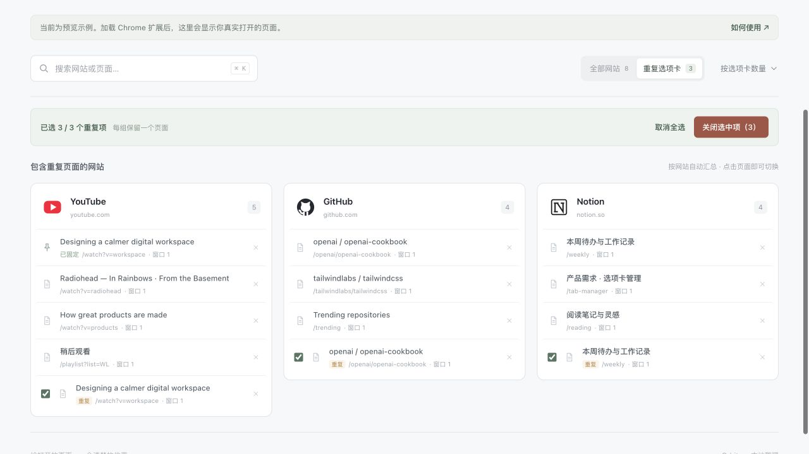

# Orbit · Chorme标签页聚合工具

一个本地运行的 Chrome 扩展，把多个浏览器窗口里打开的标签页，按网站汇总在同一页。无需账号、服务器或 AI 服务。

## 下载插件

**[下载 Orbit v0.5.0 安装包（ZIP）](https://github.com/rockcc20-max/orbit-tab-organizer/releases/download/v0.5.0/orbit-0.5.0.zip)** · [查看发布版本](https://github.com/rockcc20-max/orbit-tab-organizer/releases)

安装包已编译好，无需安装 Node.js、npm 或自行构建。下载后解压，再按下方的 [Chrome 安装步骤](#安装到-chrome) 加载即可。

请下载名为 `orbit-0.5.0.zip` 的附件，而不是 GitHub 自动提供的 `Source code (zip)` / `Source code (tar.gz)` 源码包。ZIP 版扩展需要通过 Chrome 的“开发者模式”加载，不能双击 ZIP 自动安装。

## 功能

- 网站 Logo、名称和标签页数量一目了然；每个网站下直接列出全部页面，无需展开。
- 根据本机时间显示问候语和日期；紧凑卡片布局适配宽、窄窗口。
- 搜索页面标题、网站名称或网址，按标签页数量、最近访问或名称排序。
- 点击页面切回原标签页及窗口；保留最大化、全屏状态，恢复最小化窗口。
- 查看重复标签页，勾选后确认批量关闭；也可单独关闭任意页面。
- 监听标签页与窗口变化，自动更新；样式和脚本随扩展打包，不依赖 CDN。

当前版本：`0.5.0`，使用 Manifest V3 和本地编译的 Tailwind CSS。

## 安装到 Chrome

使用上面的已编译安装包即可安装，无需编写代码。

1. [下载安装包](https://github.com/rockcc20-max/orbit-tab-organizer/releases/download/v0.5.0/orbit-0.5.0.zip)，解压到一个准备长期保留的文件夹，不要只打开 ZIP 或双击 `manager.html`。
2. 在 Chrome 地址栏输入 `chrome://extensions`，打开右上角“开发者模式”。
3. 点击“加载已解压的扩展程序”（有些版本显示“加载未打包的扩展程序”），选择解压后**直接包含 `manifest.json` 的文件夹**。从源码构建时，选择 `dist/Orbit/`。
4. 点击工具栏的拼图图标，将 Orbit 固定；之后点击 Orbit 图标即可打开总览。

如果下载的是项目源码，请先按下方说明构建。上述加载方式可参考 [Chrome 官方安装指引](https://developer.chrome.com/docs/extensions/get-started/tutorial/hello-world#load-unpacked)。

快捷键：macOS 为 `Command + Shift + 0`，Windows / Linux 为 `Ctrl + Shift + 0`。若快捷键冲突，可在 `chrome://extensions/shortcuts` 调整。

真实数据页地址以 `chrome-extension://` 开头，并显示“已实时同步”。请勿删除或移动已加载的扩展目录。更新文件后，在扩展管理页点击 Orbit 的刷新按钮，再刷新总览页。

## 产品截图

以下截图使用内置示例数据，不包含真实用户的浏览记录。安装后会显示你自己打开的标签页。

### 按网站汇总

网站 Logo、名称和页面列表集中展示，可以搜索并快速切换页面。


### 选择重复标签页

筛选重复页面，勾选需要关闭的项目，再点击“关闭选中项”确认清理。



## 从源码构建

准备 Node.js、npm，以及 `zip` / `unzip` 命令。在项目根目录运行：

```bash
npm ci
npm run check
npm run package
```

- `npm run check`：重新构建、检查脚本语法并运行自动化测试。
- `npm run package`：重新构建，生成可加载的 `dist/Orbit/` 和可分享的 `dist/orbit-0.5.0.zip`。
- 发布包只含运行文件、安装说明、许可证和隐私说明，不含开发依赖或截图。

当前打包脚本调用系统的 `zip` / `unzip`。macOS 通常自带；Linux 需确保已安装；Windows 请使用 WSL 或具备这两个命令的类 Unix 环境。仅运行构建和测试不需要这两个命令。

修改 `manager.js`、`utils.js`、`icons.js` 或 `tailwind.input.css` 后需重新构建。若 Chrome 加载的是 `dist/Orbit/`，请重新运行 `npm run package`，再到扩展管理页刷新。

## 仅预览界面

直接打开项目内的 `manager.html` 可查看示例数据。也可以在已安装 Python 3 的环境中运行：

```bash
npm run preview
```

然后访问 `http://127.0.0.1:4173/manager.html`。若源码尚未包含构建产物，先运行 `npm ci` 和 `npm run build`。

普通网页和本地 HTML **不能读取真实 Chrome 标签页**。预览页始终显示“预览模式”，切换、关闭仅影响本页示例数据，刷新后重置；这不代表扩展安装完成。

## 网站汇总与重复清理

已知网站别名（如 YouTube 与 youtu.be）合并展示；Google Docs、Gemini、Gmail 分别展示。未知网站保留完整主机名与端口，避免误合并不同托管站点或本地服务。

重复判断使用经 URL 标准化的完整网址，保留查询参数和 hash 路由，不把相似网址视为重复。批量清理会保留正在使用、固定、播放声音或加载中的页面；没有这些受保护页面时保留最近访问的一份。普通与无痕上下文不会互相判重。确认关闭前再次读取状态，跳过已跳转或不再符合条件的页面。

每行的关闭按钮是直接关闭操作，不适用批量清理保护。即使网址相同，页面内也可能有不同的未保存内容；关闭前请自行确认。

## 隐私与权限

Orbit 仅在本机使用标签页标题、网址、网站图标及窗口状态，供展示、搜索、切换和清理使用。不读取页面正文、不上传标签页数据，不含分析统计或遥测服务。

`tabs` 用于读取标签页信息；`favicon` 用于通过 Chrome 自身接口显示网站图标；`storage` 当前仅在首次安装时写入默认设置和空快照数组，不保存浏览列表。完整说明见 [PRIVACY.md](PRIVACY.md)。

## 开源许可

项目代码采用 [MIT License](LICENSE)。欢迎提交 Issue 和 Pull Request；提交截图或日志前，请先移除私人网址、令牌和个人信息。

Tailwind CSS 的许可全文见 [THIRD_PARTY_NOTICES.md](THIRD_PARTY_NOTICES.md)。网站名称、Logo 及商标归各自权利人所有，仅用于识别网站；本项目不代表相关品牌，也不授予其商标权。
